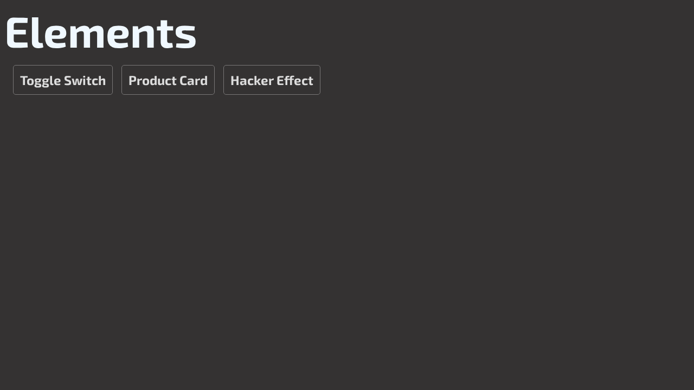

# Elements

A collection of HTML/CSS/JS UI component practice projects.

## Overview

A playground for building and experimenting with various UI components and effects using vanilla HTML, CSS, and JavaScript.

## Components

- **Hacker Effect** — Matrix-style text animation
- **Toggle Switch** — Custom animated toggle switch
- **Product Card** — Styled product card with image

## Tech Stack

- HTML5, CSS3, Vanilla JavaScript

## Getting Started

Open any `index.html` in a browser. No build step required.

## Project Structure

```
├── index.html             # Component gallery
├── style.css              # Global styles
├── fav-icon.svg
├── hacker-effect/         # Matrix text animation
│   ├── index.html
│   ├── script.js
│   └── style.css
├── toggle-swtich/         # Toggle switch component
│   ├── index.html
│   └── style.css
└── product_card/          # Product card component
    ├── index.html
    ├── style.css
    ├── itachi.jpg
    └── css.png
```


## Screenshots


## License

MIT
